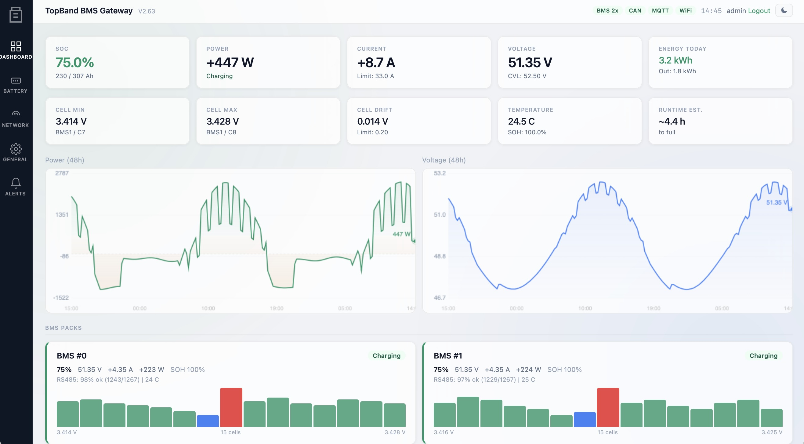

# TopBand BMS Gateway

ESP32/ESP32-S3 firmware that bridges TopBand LiFePO4 BMS battery packs to Victron, Pylontech, or SMA inverters via CAN bus. Includes a web dashboard, MQTT publishing, and Home Assistant auto-discovery.

Compatible with TopBand-based batteries including EET, Power Queen, and others using the TopBand RS485 protocol.

## Screenshots

Dashboard with live SOC, power, voltage, cell balance bars, and 48-hour history charts. Glassmorphism UI with light and dark mode.

A standalone HTML demo is available at `docs/dashboard-demo.html`. Open it directly in any browser to preview the dashboard with synthetic data (no hardware needed). Useful for UI previews.

## Features

- **Multi-pack support** up to 16 BMS packs on one RS485 bus
- **Web dashboard** with glassmorphism sidebar UI, light/dark mode, responsive mobile layout
- **48h chart history** for power, voltage, SOC, temperature
- **Energy tracking** rolling today / 7-day / monthly counters
- **MQTT publishing** with Home Assistant auto-discovery and LWT
- **Safety logic** cell voltage, drift, temperature cutoffs with hysteresis throttling
- **CAN output** Victron, Pylontech, or SMA protocol selectable
- **OTA firmware updates** via web UI
- **Settings backup/restore** as JSON
- **CSV history export**
- **mDNS** access via `topband-gateway.local`
- **Cookie-based authentication** with SHA-256 hashed password and rate limiting
- **Server-side alert ring buffer** last 25 alerts persisted in NVS
- **Runtime pin configuration** no recompile needed to switch boards
- **Per-BMS communication statistics** polls/ok/timeout/errors/spikes

## Supported Hardware

The firmware runs on any ESP32 or ESP32-S3 with RS485 and CAN transceivers. Board type and GPIO pins are configured at runtime via the web UI.

### Tested Boards

| Board | RS485 | CAN | SD | Preset |
|---|---|---|---|---|
| Waveshare ESP32-S3 with RS485/CAN hat | GPIO 17/18/21 | GPIO 15/16 | No | Built-in |
| LilyGo T-CAN485 | GPIO 22/21 | GPIO 27/26 | Yes | Built-in |
| Custom | User-defined | User-defined | No | Manual pin entry |

For custom boards: select `Custom` in General > Hardware and enter your GPIO pin assignments. Set `DIR = -1` if your RS485 transceiver has auto-direction.

## Installation

Pre-built Binary (recommended for users)
Download the latest .bin file from the Releases page and flash it via one of two methods:
- OTA Update (easiest) if you already have a working installation: open the web dashboard, go to General > OTA Firmware Update, and upload the .bin file. The device reboots into the new firmware automatically. No USB cable needed.
- USB Flash (first install) use esptool.py or the ESP Web Tools flasher to flash via USB. Example:

esptool.py --chip esp32s3 --port /dev/cu.usbserial-XXXX write_flash 0x10000 Topband_WaveshareS3_v2.63.bin

Current binaries are built for Waveshare ESP32-S3 (no SD card support). LilyGo T-CAN485 users should compile from source or request a build via GitHub Issues.

## Build from Source

### Prerequisites

- Arduino IDE 2.x or arduino-cli
- ESP32 Board Package v2.x or v3.x
- Required libraries:
  - Adafruit NeoPixel
  - WiFiManager (tzapu)
  - PubSubClient
  - ESPmDNS (bundled with ESP32 core)

### Build and Flash

1. Clone this repository
2. Open `Topband_WaveshareS3.ino` in Arduino IDE
3. Select your ESP32 board (default: ESP32S3 Dev Module)
4. Flash via USB

### First Boot

1. Device starts WiFi captive portal (SSID: `Topband-Gateway`)
2. Connect to the IP (192.168.4.1) and configure your WiFi credentials
3. Access the dashboard at `http://topband-gateway.local` or via IP
4. Navigate to `General > Hardware` and select your board type
5. Save and reboot

## Configuration

### Basic Setup

Navigate to `Battery` tab and configure:

- BMS count (1 to 16)
- Cells per BMS (0 = auto-detect)
- Charge/discharge current limits
- Charge voltage limit (CVL)
- Safety cutoffs (cell max, pack max, drift)
- Temperature ranges for charge and discharge

### Auto-Config from BMS

`Service > BMS Parameters > Apply auto-config` reads the BMS 0x47 system parameter frame and suggests safe values based on the manufacturer's limits.

### MQTT and Home Assistant

Navigate to `Network > MQTT`:

- Enable MQTT, set broker IP, port, credentials, topic
- Enable `Full data` to include per-cell voltages in payload
- Enable `HA discovery` to register entities automatically
- Click `Send HA discovery` to push discovery messages immediately

## Architecture

### Dual-Core Design

- **Core 0** `rs485Task` runs RS485 BMS polling, CAN output, and alarm/sysparam monitoring
- **Core 1** `loop` runs the web server, MQTT client, WiFi, LED, energy tracking, and NTP

### Thread Safety

- `rs485Mutex` serializes RS485 bus access between polling (Core 0) and web service requests (Core 1)
- `dataMutex` protects shared state (`victronData`, `bms[]`, alarm flags) during reads and writes

### NVS Storage

- `gateway` namespace: all configuration (BMS count, safety limits, pins, auth, MQTT, alerts ring buffer)
- `h` namespace: chart history arrays and energy counters

### Web UI

Single-page app served as a raw literal from `handleRoot()`. Polls `/data` every 2.5 seconds. Charts render client-side on HTML5 canvas. All endpoint IDs match backend `/save` POST field names.

### Alert System

Server-side detection runs on Core 1 every 10 seconds. Rising-edge triggered to avoid spam. Last 25 alerts persisted in NVS and restored on boot. Client fetches from `/alerts` or embedded in `/data`.

## Protocol

Based on reverse-engineering work from [linedot/topband-bms](https://github.com/linedot/topband-bms).

### Supported Commands

| CID2 | Function | Used by |
|---|---|---|
| 0x42 | Analog data (cell voltages, temperatures, SOC) | Main polling loop |
| 0x44 | Alarm/status bitmap | Round-robin every 15s |
| 0x47 | System parameters (limits from manufacturer) | Round-robin every 30s |
| 0x4F | Manufacturer info (HW/SW version) | Service page |
| 0xA1 | Historical events | Service page |
| 0xB1 | Date/time read | Service page |
| 0xB2 | Date/time write | Service page (manual sync) |

### CAN Output Frames

| ID | Content | Protocol |
|---|---|---|
| 0x351 | Charge/discharge voltage and current limits | Victron |
| 0x355 | SOC, SOH | Victron |
| 0x356 | Pack voltage, current, temperature | Victron |
| 0x359 | Alarm and warning flags | Victron |
| 0x35A | Protection and alarm bits | Victron |
| 0x35E | Manufacturer string | Victron |

Pylontech and SMA frame formats are selectable via `General > CAN Protocol`.

## Troubleshooting

### BMS not detected

- Check RS485 wiring (A to A, B to B, GND common)
- Verify 120 ohm termination at both ends of the bus
- Check BMS address dip switches (addresses 0 to 15)
- View `Service > BMS Diagnostics` to see raw frames

### CAN bus errors

- Check 120 ohm termination at both ends
- Verify CAN H and CAN L are not swapped
- Ensure inverter and gateway share ground
- Check CAN status in dashboard header pill

### Safety lockout

- Triggered by cell voltage, pack voltage, or drift exceeding configured limits
- Red LED flashes in lockout state
- Clear by addressing root cause and power-cycling the device
- Hysteresis prevents oscillation near thresholds

### Password reset

Power-cycle the device 5 times within 15 seconds. This clears the stored password hash and disables authentication. Set a new password via `General > Authentication`.

## Development

### UI Preview

`docs/dashboard-demo.html` is a standalone HTML page that renders the full dashboard with synthetic data for a 75% charged battery. Open it directly in any browser (no server, no dependencies). Use for screenshots, documentation, or demoing the UI without flashing hardware.

### Testing

A Python BMS simulator is available separately for testing on Raspberry Pi. It emulates TopBand RS485 responses and decodes Victron CAN frames. Scenarios: `normal`, `cold`, `hot`, `charge`, `low`.

### Debug Mode

Enable serial debug in `General > Debug` to log RS485 frames and state transitions to the serial console at 115200 baud.

### SD Card Logging (LilyGo only)

Enable SD logging to write timestamped CSV records every 60 seconds. Download via `General > Maintenance > Download SD logs`.

## Compatibility Notes

### Arduino IDE Auto-Prototypes

The IDE generates function prototypes at the top of the file, which references struct types before they are defined. V2.63 consolidates all struct definitions at the top of the file (after includes) to avoid this class of compile error across toolchain versions.

### OTA Upgrades

Direct OTA upgrade supported from V2.60 onward. Earlier versions should do a one-time USB flash first to catch up on NVS migrations.

## License

MIT License. See [LICENSE](LICENSE) file for details.

## Credits

- Protocol reverse-engineering: [linedot/topband-bms](https://github.com/linedot/topband-bms)
- Base framework: [atomi23/Topband-BMS-to-CAN](https://github.com/atomi23/Topband-BMS-to-CAN) V1.25
- Captive portal: [tzapu/WiFiManager](https://github.com/tzapu/WiFiManager)

## Contributing

Issues and pull requests welcome. Please include:

- Firmware version
- Board type and preset used
- Reproduction steps
- Serial log output if applicable

## Disclaimer

This is a DIY project. Battery systems involve high currents and can cause fire, injury, or death if misconfigured. Verify all safety limits before connecting to a live battery system. The author and contributors accept no liability for damage, injury, or loss arising from use of this firmware.
