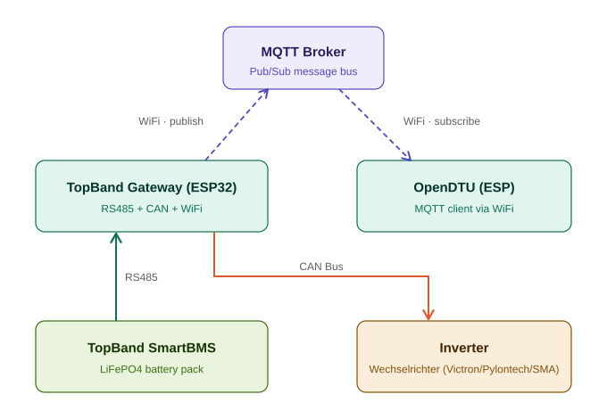
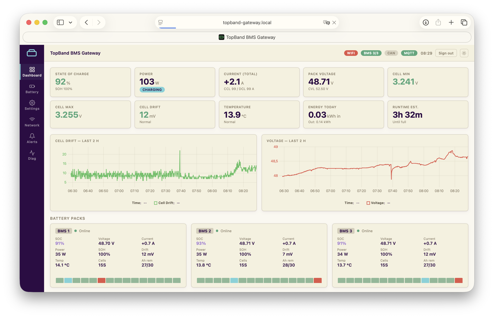

# TopBand BMS Gateway

ESP32-S3 firmware that bridges TopBand LiFePO4 BMS battery packs to Victron, Pylontech, or SMA inverters via CAN bus and to Home Assistant via MQTT. Includes a web dashboard, live charts, energy tracking, and Telegram notifications for safety alerts.

Compatible with TopBand-based batteries including EET, Power Queen, and others using the TopBand RS485 protocol.


> **V3.0 is a ground-up rewrite** of the single-file V2 Arduino sketch. The firmware is now a modular ESP-IDF codebase running natively on ESP32-S3. First install from V2 requires a USB reflash with the factory image; OTA updates work normally between V3.x releases.

> **📥 Latest release: [v3.0.0](https://github.com/swingstate/topband-bms-gateway/releases/tag/v3.0.0)** — firmware & flashing instructions.

## Architecture



## Screenshots


Dashboard with live SOC, power, voltage, cell balance bars, and history charts. Glassmorphism UI with light and dark mode.

## Demo

The UI can be previewed here: https://swingstate.github.io/topband-bms-gateway/demo/

## Features

- **Multi-pack support** up to 16 BMS packs on one RS485 bus, with per-pack and per-cell data
- **Web dashboard** with glassmorphism sidebar UI, light/dark mode, responsive mobile layout
- **Live charts** for power, voltage, SOC, temperature, and cell drift — with persistent history (2-hour fine, 7-day coarse)
- **Energy tracking** rolling today / 7-day / monthly counters
- **MQTT publishing** with Home Assistant auto-discovery, per-pack and per-cell topics
- **Safety logic** cell voltage, drift, temperature cutoffs with hysteresis
- **CAN output** Victron, Pylontech, or SMA protocol — selectable at runtime
- **Battery config modes** Auto (from BMS parameters), Auto+Margin, or Manual
- **OTA firmware updates** with 5-minute self-test and automatic rollback on failure
- **Telegram notifications** for safety alerts — configurable debounce to prevent alert floods
- **Settings backup/restore** as JSON
- **CSV history export**
- **mDNS** access via `topband-gateway.local`
- **Cookie-based authentication** with SHA-256 hashed password and rate limiting
- **Alert log** persisted to flash, with per-event severity and timestamp
- **Board selector** Waveshare preset or Manual pin entry for any qualifying ESP32-S3 board
- **Per-BMS communication statistics** polls/ok/timeout/errors
- **Tiered MQTT detail levels** off / per-pack statistics / per-cell voltages
- **Diagnostics panel** with gateway self-monitoring counters, stack high-water marks, and coredump capture

## Supported Hardware

V3.0 requires an ESP32-S3 with **16 MB flash and 8 MB PSRAM**. Board type and GPIO pins are configured at runtime via the web UI.

### Tested Boards

| Board | RS485 | CAN | Preset |
|---|---|---|---|
| Waveshare ESP32-S3 with RS485/CAN hat | GPIO 17/18/21 | GPIO 15/16 | Built-in |
| Custom ESP32-S3 | User-defined | User-defined | Manual pin entry |

For custom boards: select `Manual` in Settings → Hardware and enter your GPIO pin assignments. Set `DIR = -1` if your RS485 transceiver has automatic direction control.

> LilyGo T-CAN485 (classic ESP32, 4 MB flash, no PSRAM) is not compatible with V3.0.

## Installation

### Pre-built Binary (Recommended)

Download the release files from the [Releases page](../../releases).

**First install (USB):** write the factory image, which bundles the bootloader, partition table, and firmware in a single file.

```bash
# macOS / Linux
esptool.py --chip esp32s3 --port /dev/cu.usbserial-XXXX write_flash 0x0 Topband-bms-gateway-factory-v3.0.0.bin

# Windows (adjust COM port)
esptool.py --chip esp32s3 --port COM3 write_flash 0x0 Topband-bms-gateway-factory-v3.0.0.bin
```

If upgrading from V2.67.x, erase the flash first (new partition layout):

```bash
esptool.py --chip esp32s3 --port /dev/cu.usbserial-XXXX erase_flash
```

**OTA update (existing V3.x install):** open the web dashboard, go to Settings → OTA Firmware Update, and upload `Topband-bms-gateway-v3.0.0.bin`. The device reboots, runs a 5-minute self-test, and rolls back automatically if the self-test fails.

> Upgrading from V2.67.x to V3.0 via OTA is not supported. Use the USB factory image. Back up your V2 settings first (General → Maintenance → Export settings in V2), then restore them after V3 first boot.

## Build from Source

### Prerequisites

- [PlatformIO](https://platformio.org/) (installs ESP-IDF automatically)
- Python 3.8+ (for build scripts)
- Git

### Build and Flash

```bash
git clone <this repo>
cd topband-bms-gateway

# Build
pio run

# Flash over USB
pio run -t upload

# OTA flash (existing V3.x install)
pio run -t upload --upload-port <gateway-ip>

# Serial monitor
pio device monitor
```

### Unit Tests (no hardware required)

```bash
pio test -e native
```

### First Boot

1. The device starts a WiFi captive portal (SSID: `Topband-Setup-XXXX`)
2. Connect and configure your WiFi credentials at `192.168.4.1`
3. Access the dashboard at `http://topband-gateway.local` or via the device IP
4. Go to Settings → Hardware and select your board type
5. Save and reboot

## Configuration

### Basic Setup

Navigate to the Battery tab and configure:

- BMS count (1 to 16)
- Cells per BMS (0 = auto-detect)
- Battery config mode (Auto / Auto+Margin / Manual)
- Charge/discharge current limits
- Charge voltage limit (CVL)
- Safety cutoffs (cell max, pack max, drift)
- Temperature ranges for charge and discharge

### Auto-Config from BMS

Settings → Battery → Apply auto-config reads the BMS system parameter frame (0x47) and suggests safe values based on the manufacturer's limits. Choose Auto to apply directly, Auto+Margin to apply with a safety margin, or Manual to set all limits yourself.

### MQTT and Home Assistant

Navigate to Network → MQTT:

- Enable MQTT, set broker IP, port, credentials, and base topic
- Set detail level: off / per-pack statistics / per-cell voltages
- Enable HA discovery to register entities automatically
- Click Send HA discovery to push discovery messages immediately

### Telegram Notifications

Navigate to Network → Notifications:

- Enable Telegram, enter your bot token and chat ID
- Use the Test button to verify delivery before saving
- Notifications are sent for safety events (overvoltage, undervoltage, temperature cutoff, imbalance) with configurable debounce to prevent alert floods

## Architecture

### Dual-Core Design

- **Core 0** `ControlTask` runs BMS RS485 polling, safety evaluation, and CAN TX in sequential phases. No network I/O touches Core 0.
- **Core 1** runs HTTP, MQTT, history accumulation, and housekeeping tasks concurrently. Tasks are event-driven and independent of each other.

### Lock-Free Data Path

BMS snapshots travel from Core 0 to Core 1 through a seqlock double-buffer in PSRAM. Core 1 tasks read the latest snapshot without holding a mutex, eliminating the watchdog-reboot class of bugs that affected V2.67.

### Storage

- **NVS:** one versioned Config blob (~600 B), CRC-protected. Schema-migrated automatically on upgrade.
- **LittleFS:** history ring files (2-hour fine / 7-day coarse), persisted alert log, energy counters, and web UI assets.
- Session tokens are RAM-only and regenerated each boot.

### Web UI

Static files served from LittleFS via `esp_http_server`. The dashboard polls `/api/live` every 1.5 seconds by default. Charts render client-side on HTML5 canvas. All configuration changes go through POST endpoints with CSRF protection.

### Alert System

Safety events are generated by `runSafety()` — a pure function on Core 0 with no I/O and no globals, fully unit-testable on host. Events are routed to the persisted alert log and, when configured, to Telegram via the notify module. Rising-edge debounced to suppress transient noise.

## Protocol

Based on reverse-engineering work from [linedot/topbands-bms](https://github.com/linedot/topbands-bms).

### Supported Commands

| CID2 | Function | Used by |
|---|---|---|
| 0x42 | Analog data (cell voltages, temperatures, SOC) | Main polling loop |
| 0x44 | Alarm/status bitmap | Round-robin every 15s |
| 0x47 | System parameters (limits from manufacturer) | Round-robin every 30s |
| 0x4F | Manufacturer info (HW/SW version) | Service page |
| 0xA1 | Historical events | Service page |
| 0xB1 | Date/time read | Service page |
| 0xB2 | Date/time write | Service page (manual sync) |

### CAN Output Frames

| ID | Content | Protocol |
|---|---|---|
| 0x351 | Charge/discharge voltage and current limits | Victron |
| 0x355 | SOC, SOH | Victron |
| 0x356 | Pack voltage, current, temperature | Victron |
| 0x359 | Alarm and warning flags | Victron |
| 0x35A | Protection and alarm bits | Victron |
| 0x35E | Manufacturer string | Victron |

Pylontech and SMA frame formats are selectable via Settings → Battery → CAN Protocol.

## Troubleshooting

### BMS not detected

- Check RS485 wiring (A to A, B to B, GND common)
- Verify 120 ohm termination at both ends of the bus
- Check BMS address dip switches (addresses 0 to 15)
- View the Diagnostics panel to see raw RS485 frames and per-BMS poll statistics

### CAN bus errors

- Check 120 ohm termination at both ends
- Verify CAN H and CAN L are not swapped
- Ensure inverter and gateway share ground
- Check CAN status in the dashboard header pill

### Safety lockout

- Triggered by cell voltage, pack voltage, drift, or temperature exceeding configured limits
- Clears automatically once the underlying condition resolves within normal range
- Check the Alert log for the specific event and timestamp
- If limits are triggering incorrectly, review the thresholds in the Battery tab

### Factory reset / password reset

Factory reset and password reset are done via the web UI: Settings → Factory Reset. If you cannot reach the UI, reflash the factory image via USB — this resets all settings to defaults.

## Development

### Testing

A Python BMS simulator is available separately for testing on Raspberry Pi. It emulates TopBand RS485 responses and decodes Victron CAN frames. Scenarios: `normal`, `cold`, `hot`, `charge`, `low`.

Host-side unit tests cover BMS protocol parsing, safety logic, CAN frame encoding, and MQTT payload schema:

```bash
pio test -e native
```

### Debug Mode

Enable serial debug in Settings → Diagnostics to log RS485 frames and state transitions to the serial console at 115200 baud.

## Compatibility Notes

### OTA Upgrades

OTA upgrades are supported between V3.x releases. The first install of V3.0 requires a USB reflash with the factory image (new partition layout). After V3.0 is installed, all subsequent updates can be done via OTA.

### Home Assistant Entities

V3.0 MQTT topic names and payload fields differ from V2.67.x. Existing V2 HA dashboards will need to be updated. Use Settings → Send HA Discovery to re-register all entities after upgrading.

### Known Limitations (V3.0)

- No TLS for HTTP or MQTT connections (planned for a future release)
- Telegram is the only supported notification channel; additional providers are planned for V3.1+
- SD card logging is not supported in V3.0

## License

MIT License. See [LICENSE](LICENSE) file for details.

## Credits

- Protocol reverse-engineering: [linedot/topband-bms](https://github.com/linedot/topband-bms)
- Original groundwork: [atomi23/Topband-BMS-to-CAN](https://github.com/atomi23/Topband-BMS-to-CAN)
- Earlier firmware lineage used [tzapu/WiFiManager](https://github.com/tzapu/WiFiManager) for captive portal; V3.0 uses a custom implementation

## Contributing

Issues and pull requests welcome. Please include:

- Firmware version
- Board type and preset used
- Reproduction steps
- Serial log output if applicable

## Disclaimer

This is a DIY project. Battery systems involve high currents and can cause fire, injury, or death if misconfigured. Verify all safety limits before connecting to a live battery system. Test thoroughly with your own hardware before relying on the firmware for protection. The author and contributors accept no liability for damage, injury, or loss arising from use of this firmware.
