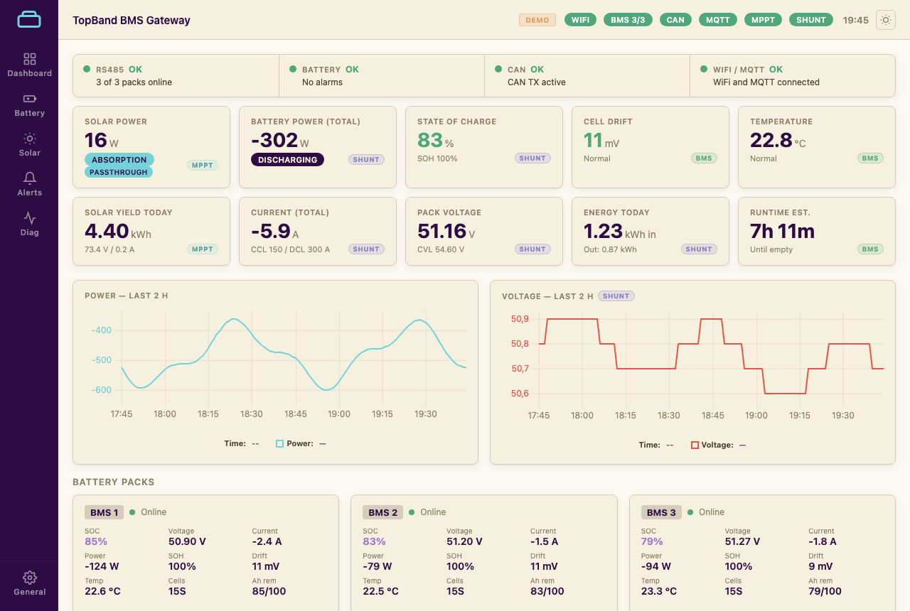
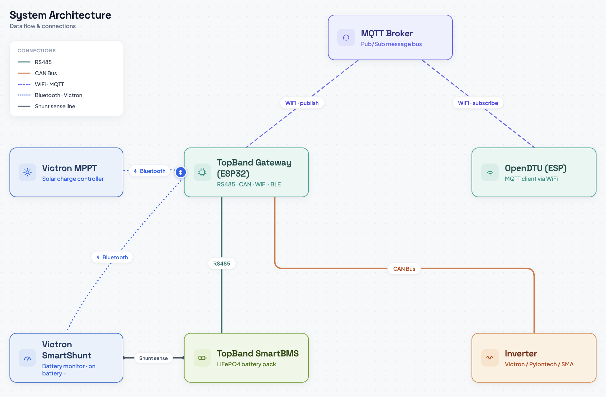

# TopBand BMS Gateway

ESP32-S3 firmware that bridges TopBand LiFePO4 BMS battery packs to Victron, Pylontech, or SMA inverters via CAN bus and to Home Assistant via MQTT. Includes a web dashboard, live charts, energy tracking, and Telegram notifications for safety alerts.

Compatible with TopBand-based batteries including EET, Power Queen, and others using the TopBand RS485 protocol.


> **New in V3.4: a health summary on the dashboard and a better phone layout.** A status card at the top of the dashboard shows at a glance whether RS485, the battery, CAN and WiFi/MQTT are OK. The Battery page summary tiles now fit an iPhone screen, the Drift Details show each cell's current voltage, and the Diagnostics log no longer jumps while you read it. No changes to safety logic, CAN output or settings.

## What's new in V3.4

- **Health summary card.** Four indicators at the top of the dashboard (RS485, Battery, CAN, WiFi/MQTT), each shown as OK, Warning or Fault with a short reason such as "3 of 3 packs online" or "MQTT disconnected". Tap an indicator to open the related page. The card only displays what the gateway already reports; it makes no decisions of its own.
- **Battery page on phones.** The four summary tiles (SOC, pack voltage, current, power) stay on one line on narrow screens, and their values and source badges line up. The desktop layout is unchanged.
- **Current cell voltage in Drift Details.** Each cell row shows its voltage right now (for example "3.312 V") next to its 5-day span. It shows "—" when the pack is offline or the data is out of date.
- **Diagnostics log.** The log no longer jumps back to the bottom every few seconds while you scroll up to read it, and each entry is on its own line.

## Release history

Changes in every earlier version, from V2.66 through V3.3, are listed in [CHANGELOG.md](CHANGELOG.md). Release notes and downloads for each version are on the [Releases page](https://github.com/swingstate/topband-bms-gateway/releases).

## Screenshots



Dashboard with the health summary card, live SOC, power, voltage and energy values, and history charts. Light and dark mode.

An interactive demo with synthetic data runs in the browser, no hardware needed: [swingstate.github.io/topband-bms-gateway/demo](https://swingstate.github.io/topband-bms-gateway/demo/).

## Features

- **Multi-pack support** up to 16 BMS packs on one RS485 bus, with per-pack and per-cell data
- **Bluetooth LE** read a Victron MPPT solar charger and/or a Victron SmartShunt battery monitor; data flows into the dashboard, MQTT, and energy tracking
- **Battery Value Sources** choose whether the SmartShunt or the BMS packs lead the dashboard's current/voltage/charge-percentage reading, automatically or manually — charging/discharging decisions always use the BMS packs regardless
- **Web dashboard** with light/dark mode and a phone layout with a bottom tab bar
- **Health summary card** RS485, Battery, CAN and WiFi/MQTT status at a glance, each with a short reason
- **Live charts** for power, voltage, SOC, temperature, and cell drift — with persistent history (2-hour fine, 7-day coarse)
- **Solar page** day chart of solar power, MPPT charger output, and Solar-Passthrough status
- **Battery Drift Details** per-cell balance and drift over 5 days, measured at the charge extremes, with each cell's current voltage
- **Energy tracking** today / 7-day / monthly / total counters
- **MQTT publishing** with Home Assistant auto-discovery, per-pack and per-cell topics
- **Safety logic** cell voltage, drift, temperature cutoffs with hysteresis; a voltage or overcurrent lockout only blocks the affected direction (charge or discharge), not both
- **CAN output** Victron, Pylontech, or SMA protocol — selectable at runtime; reports the SmartShunt-fused current/charge-percentage to the inverter when a shunt is connected
- **Preferred WiFi access point** optional BSSID pin for multi-AP/mesh networks, with automatic fallback and re-pin
- **Battery config modes** Auto (from BMS parameters), Auto+Margin, or Manual
- **OTA firmware updates** with 5-minute self-test and automatic rollback on failure
- **Telegram notifications** for safety alerts — configurable debounce to prevent alert floods
- **Settings backup/restore** as JSON, plus automatic backup over MQTT on every settings change (and daily), with explicit manual restore
- **CSV history export** via `/api/history/export.csv`
- **Cookie-based authentication** with SHA-256 hashed password
- **Alert log** persisted to flash, with per-event severity and timestamp
- **Board selector** Waveshare preset or Manual pin entry for any qualifying ESP32-S3 board
- **Per-BMS communication statistics** polls/ok/timeout/errors
- **Tiered MQTT detail levels** off / per-pack statistics / per-cell voltages
- **Diagnostics page** with RS485, battery and CAN sections, gateway self-monitoring counters, stack high-water marks, and coredump capture

## Supported Hardware

V3.x requires an ESP32-S3 with **16 MB flash and 8 MB PSRAM**. Board type and GPIO pins are configured at runtime via the web UI. Bluetooth uses the ESP32-S3's built-in radio — no extra hardware needed.

### Tested Boards

| Board | RS485 | CAN | Preset |
|---|---|---|---|
| Waveshare ESP32-S3-RS485-CAN | GPIO 17/18/21 | GPIO 15/16 | Built-in |
| Custom ESP32-S3 | User-defined | User-defined | Manual pin entry |

For custom boards: select `Manual` in Settings → Hardware and enter your GPIO pin assignments. Set `DIR = -1` if your RS485 transceiver has automatic direction control.

> LilyGo T-CAN485 (classic ESP32, 4 MB flash, no PSRAM) is not compatible with V3.x.

## Installation

### Pre-built Binary (Recommended)

Download the release files from the [Releases page](https://github.com/swingstate/topband-bms-gateway/releases). Each release has two images:

- `Topband-bms-gateway-factory-vX.Y.Z.bin` — bootloader, partition table and firmware in one file, for a first install over USB. Always write it at offset `0x0` (the firmware inside it sits at `0x20000`).
- `Topband-bms-gateway-ota-vX.Y.Z.bin` — firmware only, for updates through the web UI.

**First install (USB):** write the factory image at offset `0x0`.

```bash
# macOS / Linux
esptool.py --chip esp32s3 --port /dev/cu.usbserial-XXXX write_flash 0x0 Topband-bms-gateway-factory-v3.4.0.bin

# Windows (adjust COM port)
esptool.py --chip esp32s3 --port COM3 write_flash 0x0 Topband-bms-gateway-factory-v3.4.0.bin
```

If upgrading from V2.67.x, erase the flash first (new partition layout):

```bash
esptool.py --chip esp32s3 --port /dev/cu.usbserial-XXXX erase_flash
```

**OTA update (existing V3.x install):** open the web dashboard, go to Settings → System → Firmware Update, and upload `Topband-bms-gateway-ota-v3.4.0.bin`. The device reboots, runs a 5-minute self-test in the background, and rolls back automatically if the self-test fails. Do not upload the factory image here.

> Upgrading from V2.67.x to V3.x via OTA is not supported. Use the USB factory image. Back up your V2 settings first (General → Maintenance → Export settings in V2), then restore them after V3 first boot.

### First Boot

1. The device starts a WiFi captive portal (SSID: `TopBand-Setup-XXXX`)
2. Connect and configure your WiFi credentials at `192.168.4.1`
3. Open the dashboard at the device's IP address. You can find it in your router's client list, where the gateway appears as `topband-bms-xxxx` (the last four hex digits of its MAC address).
4. Go to Settings → Hardware and select your board type
5. Save and reboot

## Configuration

### Basic Setup

Go to Settings → Battery and configure:

- BMS pack count (1 to 16)
- Force cell count (0 = auto-detect)
- Battery config mode (Auto / Auto+Margin / Manual)
- Charge/discharge current limits per pack
- Charge voltage limit (CVL)
- Safety cutoffs (safe pack voltage, safe cell voltage, max cell drift)
- Temperature ranges for charge and discharge

### Battery Config Mode

The gateway reads each pack's system parameters (BMS frame 0x47), which contain the manufacturer's charge/discharge and temperature limits. In **Auto** mode those limits are used directly. **Auto+Margin** uses them with a safety margin. In **Manual** mode you set all limits yourself in Settings → Battery. If the pack parameters are more than 5 minutes old, the gateway falls back to your configured values.

### Bluetooth / Victron MPPT and SmartShunt

Go to Settings → BLE:

- Enable Bluetooth and enter the device's encryption key (from the VictronConnect app) — MPPT and SmartShunt are configured independently, and you can use either or both
- Once paired, the MPPT's solar data appears on the Solar page and the dashboard; the SmartShunt's current, voltage, and charge percentage appear on the Battery page and dashboard
- Both are read-only — the gateway never sends commands to either device
- With a SmartShunt paired, set **Battery Value Sources** (Settings → Battery) to choose whether the shunt or the BMS packs lead the dashboard reading — Auto lets the shunt lead whenever its reading is fresh and falls back to the BMS packs otherwise; charging/discharging safety limits always use the BMS packs regardless of this setting

### CAN / Inverter

Go to Settings → CAN and select the inverter protocol (Victron, Pylontech, or SMA).

### MQTT and Home Assistant

Go to Settings → MQTT:

- Enable MQTT, set broker IP, port, credentials, and base topic
- Set detail level: off / per-pack statistics / per-cell voltages
- Enable HA discovery to register entities automatically
- Click Re-send HA Discovery to push discovery messages immediately
- Optional: set the Solar Passthrough (OpenDTU) topic if you run OpenDTU-onBattery and want to see its status on the dashboard
- While connected, the gateway automatically publishes a retained settings backup on every change (and once daily) — use **Settings → System → Restore from MQTT Backup** to recover settings after a reset. WiFi/MQTT connection details and the dashboard login username are never included, and restoring is always a manual, confirmed action.

### Telegram Notifications

Go to Settings → Notify:

- Enable Telegram, enter your bot token and chat ID
- Use the Test button to verify delivery before saving
- Notifications are sent for safety events (overvoltage, undervoltage, temperature cutoff, imbalance) with configurable debounce to prevent alert floods

### Backup and Restore

Settings → System → Maintenance has Download Backup (a JSON file of all settings) and Import Backup.

## Architecture



### Dual-Core Design

- **Core 0** `ControlTask` runs BMS RS485 polling, safety evaluation, and CAN TX in sequential phases. No network I/O touches Core 0.
- **Core 1** runs HTTP, MQTT, Bluetooth, history accumulation, and housekeeping tasks concurrently. Tasks are event-driven and independent of each other.

### Lock-Free Data Path

BMS snapshots travel from Core 0 to Core 1 through a seqlock double-buffer in PSRAM. Core 1 tasks read the latest snapshot without holding a mutex, eliminating the watchdog-reboot class of bugs that affected V2.67.

### Storage

- **NVS:** one versioned Config blob (880 B), CRC-protected. Schema-migrated automatically on upgrade.
- **LittleFS:** history ring files (2-hour fine / 7-day coarse), persisted alert log, energy counters, and web UI assets.
- **PSRAM:** large history buffers, the solar day-ring, and per-cell drift history live in PSRAM, keeping internal RAM free.
- Session tokens are RAM-only and regenerated each boot.

### Web UI

Static files served from LittleFS via `esp_http_server`. The dashboard polls `/api/live` every 2 seconds. Values and charts update in place on each poll. All configuration changes go through POST endpoints with CSRF protection.

### Alert System

Safety events are generated by `runSafety()` — a pure function on Core 0 with no I/O and no globals, fully unit-testable on host. Events are routed to the persisted alert log and, when configured, to Telegram via the notify module. Rising-edge debounced to suppress transient noise.

## Protocol

Based on reverse-engineering work from [linedot/topband-bms](https://github.com/linedot/topband-bms).

### Supported Commands

| CID2 | Function | Polling |
|---|---|---|
| 0x42 | Analog data (cell voltages, temperatures, SOC) | Every pack, every 3 s |
| 0x44 | Alarm/status bitmap | Round-robin, one pack every 3 s, alternating with 0x47 |
| 0x47 | System parameters (limits from manufacturer) | Round-robin, one pack every 3 s, alternating with 0x44 |

### CAN Output Frames

| ID | Content | Victron | Pylontech | SMA |
|---|---|---|---|---|
| 0x351 | Charge voltage and charge/discharge current limits (Pylontech also sends the discharge voltage limit) | yes | yes | yes |
| 0x355 | SOC, SOH | yes | yes | yes |
| 0x356 | Pack voltage, current, temperature | yes | yes | yes |
| 0x359 | Alarm and warning flags | | yes | |
| 0x35A | Alarm and warning flags | yes | | yes |
| 0x35B | Warning flags | | | yes |
| 0x35C | Charge/discharge enable and force-charge request | | yes | |
| 0x35E | Manufacturer string | yes | yes | yes |

The protocol is selected in Settings → CAN.

The Victron MPPT and SmartShunt are read over Bluetooth, not CAN — they do not use these frames.

## Troubleshooting

### BMS not detected

- Check RS485 wiring (A to A, B to B, GND common)
- Verify 120 ohm termination at both ends of the bus
- Check BMS address dip switches (addresses 0 to 15)
- The RS485 indicator in the dashboard's health card shows how many packs are online; the RS485 bus section of the Diagnostics page shows per-pack poll statistics (ok, timeouts, errors)

### CAN bus errors

- Check 120 ohm termination at both ends
- Verify CAN H and CAN L are not swapped
- Ensure inverter and gateway share ground
- Check the CAN indicator in the dashboard's health card, and the CAN → inverter section of the Diagnostics page for frame counters and the values being sent

### Bluetooth / MPPT or SmartShunt not showing data

- Confirm the encryption key matches the one in the VictronConnect app — pasted keys with extra characters (from a photo/OCR) are cleaned up automatically, but check the Diagnostics page's **Key valid** row if data still isn't showing
- The device must be within Bluetooth range of the gateway
- Solar data only appears once the MPPT is actively charging or reporting; check the Bluetooth section on the Diagnostics page for advertisement counts
- The first solar chart point appears about 5 minutes after boot (the chart samples every 5 minutes)
- A SmartShunt that has never been set up in the VictronConnect app shows as **Not synced** rather than a charge percentage — pair it in VictronConnect first

### Safety lockout

- Triggered by cell voltage, pack voltage, drift, temperature, or a BMS-reported overcurrent exceeding limits
- A lockout only blocks the affected direction — over-voltage blocks charging, under-voltage blocks discharging, charge or discharge overcurrent blocks only that direction — so the pack can still self-correct in the other direction
- The Battery indicator in the dashboard's health card turns red and names the reason while a lockout is active
- Clears automatically once the underlying condition resolves within normal range
- Check the Alert log for the specific event, direction, and timestamp
- If limits are triggering incorrectly, review the thresholds in Settings → Battery

### Factory reset / password reset

Factory reset and password reset are done via the web UI: Settings → Reset. If you cannot reach the UI, reflash the factory image via USB — this resets all settings to defaults.

## Compatibility Notes

### OTA Upgrades

OTA upgrades are supported between V3.x releases, including V3.0 through V3.4. The first install of V3.x requires a USB reflash with the factory image (new partition layout). After that, all updates can be done via OTA.

### Home Assistant Entities

V3.1 added new MQTT entities for the Victron MPPT (solar power, charger output, yield, charger state). V3.2 added entities for the Victron SmartShunt (current, voltage, charge percentage, consumed amp-hours) and per-pack current/charge-percentage/power entities. They register automatically via HA discovery. If you're upgrading from an earlier version, use Settings → MQTT → Re-send HA Discovery to register any new entities.

V3.x MQTT topic names and payload fields differ from V2.67.x. Existing V2 HA dashboards need to be updated.

### Known Limitations

- No TLS for HTTP or MQTT connections (planned for a future release)
- Telegram is the only supported notification channel for now
- SD card logging is not supported
- Drift history: completed days persist across reboots; the current day's partial data rebuilds after a restart

## License

MIT License. See [LICENSE](LICENSE) file for details.

## Credits

- Protocol reverse-engineering: [linedot/topband-bms](https://github.com/linedot/topband-bms)
- Original groundwork: [atomi23/Topband-BMS-to-CAN](https://github.com/atomi23/Topband-BMS-to-CAN)
- Earlier firmware lineage used [tzapu/WiFiManager](https://github.com/tzapu/WiFiManager) for captive portal; V3.x uses a custom implementation

## Contributing

Issues and pull requests welcome. Please include:

- Firmware version
- Board type and preset used
- Reproduction steps
- Serial log output if applicable

## Disclaimer

This is a DIY project. Battery systems involve high currents and can cause fire, injury, or death if misconfigured. Verify all safety limits before connecting to a live battery system. Test thoroughly with your own hardware before relying on the firmware for protection. The author and contributors accept no liability for damage, injury, or loss arising from use of this firmware.
